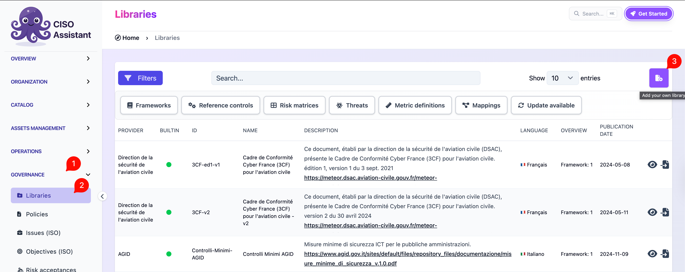

# CIS Controls / Cloud Controls Matrix (CCM)

CIS Controls and the Cloud Security Alliance's Cloud Controls Matrix (CCM) ship as Excel spreadsheets that OptiTech can convert and load directly — no command-line preparation required.


CIS and CSA have restrictive licence terms on their content, so the spreadsheets are not bundled with OptiTech. You have to download the official spreadsheet from CIS or CSA yourself and then upload it to the platform.


## Direct import

1. Download the CIS Controls or CCM spreadsheet from the relevant authority's website.
2. In OptiTech, go to **Libraries** and click **Add your own library**.

   <figure><figcaption></figcaption></figure>
3. Select the downloaded spreadsheet and upload it. OptiTech converts it to the platform's library format on the fly.

   .png>)
4. Once the conversion finishes, load the new library like any other.
